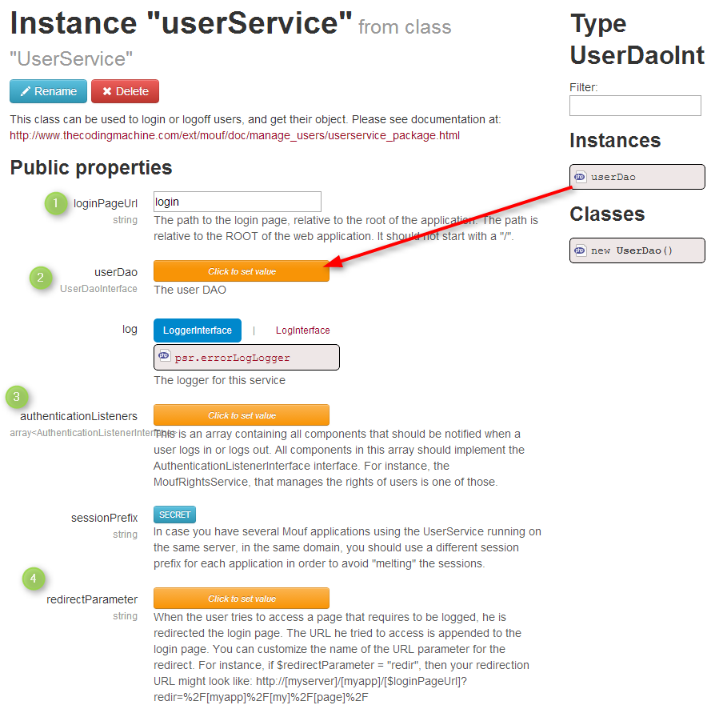

Congigure UserService Instance
------------------------------------------------------

In Mouf, open the page for the **userService** instance:




1. `loginPageUrl`: Path to the login page relative to the root URL of the application
2. `userDao`: The Dao the userService must refers to
3. `authenticationListener`: a list of object that will be notified when a user logs in or out. Used by [RightService](http://mouf-php.com/packages/mouf/security.rightsservice/README.md).
4. `redirectParameter`: Path to the page if a user tries to access a page that requires to be logged


Basic usage
-----------

Ok, the user service is now ready to be used.

Log a user in your application:

```php
Mouf::getUserService()->login("email", "password");
```

Check if a user is logged:

```php
$isLogged = Mouf::getUserService()->isLogged();
```

Get the current user:

```php
$user = Mouf::getUserService()->getLoggedUser();
```

Logout a user:

```php
$user = Mouf::getUserService()->logoff();
```


Now, you have to possibilities:
-------------------------------
> Make your own login page : [Quick example](userservicesample.md)

> Use the SimpleLoginController : [SimpleLogincontroller](http://mouf-php.com/packages/mouf/security.simplelogincontroller/README.md)