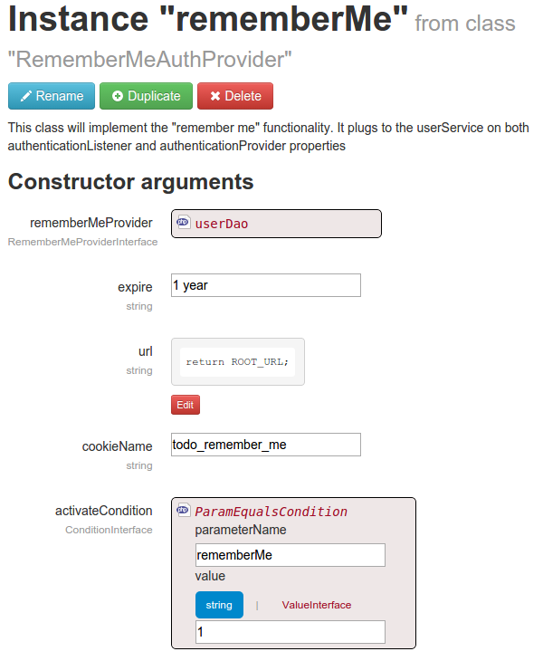
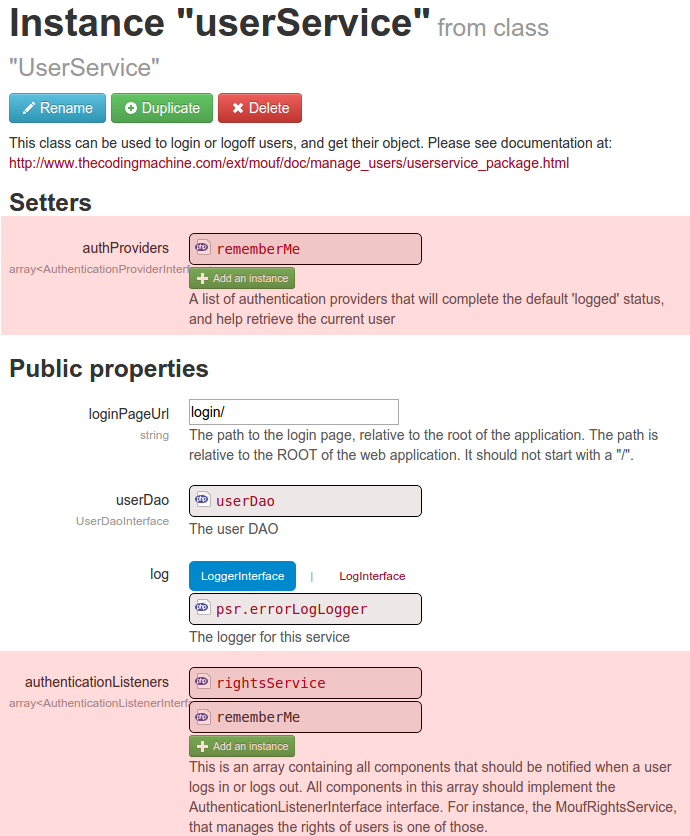

Activate the **Remember Me** feature (through cookie)
------------------------------------------------------

If you want users to be remembered on you application, it is quite easy. All you have to do is :

1. create a `RememberMeAuthProvider` instance (let's call it **rememberMeAuthProvider**).
2. implement the `RememberMeProviderInterface` in your project and link it to the **rememberMeAuthProvider** instance. Generally, you may use the same userDao instance you have linked to the **userService** (see [Congigure UserService Instance](configure_user_service.md))
3. link the **rememberMeAuthProvider** instance to the **userService** one as both **authProviders** and **authenticationListeners**. 

Steps in detail :

## 1. Create a *RememberMeAuthProvider* instance



This instance is bound to:

* a `RememberMeProviderInterface` (see stpe 2) that should be implement two methods : `getUserByRememberMeToken($token)` that will return a `UserInterface` object corresponding to the given `$token`, and `setUserRememberMeToken(UserInterface $user, $token)` that will set (a&nd persist) the token for a given user.
* a `ConditionInterface` that will tell when the Remember Me feature should be activated. This depends on your project, but you often will do it by a "remember me" checkbox in you login form. If you want it to be active no matter what, just set a `TrueCondition` instance.

### 2. implement the *RememberMeProviderInterface*

You may usually use the same instance you bound to the **userService.userDao**. Here is an implementation example

```php
/**
 * Identify the current user by the "remember me" cookie if exists
 * @param UserServiceInterface $userService
 * @return UserInterface
 */
public function getUserByRememberMeToken($token){
    $userInfo = \Mouf::getUserInfoDao()->getByRememberMeToken($token);
    if ($userInfo){
        return $userInfo->getUser();
    }
    return null;
}

/**
 * Sets the "remember me" cookie value into the user
 * @param UserInterface $user
 * @param string $token
 */
function setUserRememberMeToken(UserInterface $user, $token){
    /* @var $user UserBean */
    $userInfo = $user->getInfo();
    $userInfo->setRememberMeToken($token);
    $userInfo->save();
}
```

### 3. link the *rememberMeAuthProvider* instance to the **userService**



That's it, you're done !