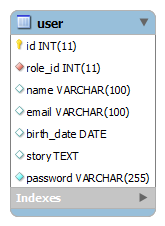

Configure the project
========================

Your UserService is installed but you still need to explain it how to query the user's database.
It's necessary to implement `UserDaoInterface` and `UserInterface` in your project.


The `UserService` needs to be connected to a `UserDao` object that you will develop.
This `UserDao` must implement the `UserDaoInterface`.
Each object representing a user returned by the `UserDao` class must implement the `UserInterface`.

Setting up the DAO
------------------

For the following exemple, I'll use TDBM ([see TDBM documentation for more information](http://mouf-php.com/packages/mouf/database.tdbm/index.md)).
I'll use the user table like:


TDBM will create automatically for us a `UserDao` class. However, this class does not contain all the methods the `UserService` needs.
The `UserDao` must implement the `UserDaoInterface`.

First : implement <code>UserDaoInterface</code>:

<code>UserDaoInterface</code> contains five functions to be implemented:

[**UserDaoInterface.php**](https://github.com/thecodingmachine/security.userservice/blob/2.0/src/Mouf/Security/UserService/UserDaoInterface.php)
```php
interface UserDaoInterface {
	public function getUserByCredentials($login, $password);
	public function getUserByToken($token);
	public function discardToken($token);
	public function getUserById($id);
	public function getUserByLogin($login);
}
```

In this example, the login is the email column and the password is the password column:

**UserDao.php**	
```php
class UserDao extends UserDaoBase implements UserDaoInterface {
	public function getUserByCredentials($login, $password){
		$user = $this->getByFilter(array(
			new EqualFilter("user", "email", $login)
		));

		if ($user){
			// User exists.
			// Is the password correct?
			// Note: this is using PHP >= 5.5 password_hash function.
			if (password_verify($password, $user->getPassword()) {
				return $user;
			} else {
				return NULL;
			}
		}else{
			// User does not exist
			return NULL;
		}
	}
	public function getUserByToken($token){
		// You should implement this if you want to be able to autolog a user by token (useful
		// for forgotten passwords)
		throw new \Exception("To be implemented");
	}
	public function discardToken($token){
		// You should implement this if you want to be able to autolog a user by token (useful
		// for forgotten passwords)
		throw new \Exception("To be implemented");
	}
	public function getUserById($id){
		return $this->getById($id);
	}
	public function getUserByLogin($login){
		$user = $this->getByFilter( new EqualFilter("user", "email", $login));
		return $user;
	}
}
```

Then, implements the <code>UserInterface</code> :

<code>UserInterface</code> contains two methods:

[**UserInterface.php**](https://github.com/thecodingmachine/security.userservice/blob/2.0/src/Mouf/Security/UserService/UserInterface.php)	
```php
interface UserInterface {
	public function getId();
	public function getLogin();
}
```

It's necessary to implement the <code>UserInterface</code> and its methods in my <code>UserBean</code> :

**UserBean.php**	
```php
class UserBean extends UserBaseBean implements UserInterface{
	public function getLogin(){
		return $this->getEmail();
	}
	// getId() is already implemented by UserBaseBean
}
```


Next steps
----------

> [Configure UserService Instance](configure_user_service.md)