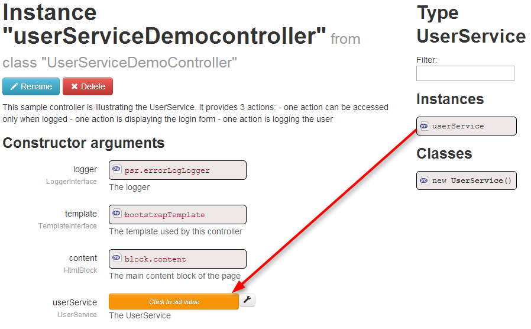

UserService - Quick Example
===========================

In this example, I want to display the login page if the user is not logged or a message if he's logged, managed by my <code>userServiceController.php</code>

First : Declare UserService on your controller
----------------------------------------------
<pre>
/**
* @var UserService
*/
private $userSercice;
</pre>

Then : Bind the UserService into userServiceController
------------------------------------------------------

Find userServiceController in Mouf interface and drag and drop the <code>userService</code> instance to your UserService's variable:




Finally : Code the function which displays information
------------------------------------------------------

At this step, you can use the [userservice-splash package](http://mouf-php.com/packages/mouf/security.userservice-splash/README.md) to use the <code>@Logged</code> annotation

<code>userServiceController</code> : 
<pre>
	/**
	 * @var UserService
	 */
	private $userService;
	
	/**
	 * @var UserBean
	 */
	protected $currentUser;

	/**
	 * This page can be accessed only when a user is logged.
	 * @URL protected_resource
	 */
	public function userServiceView() {
		$islogged = $this->userService->isLogged();
		if(!$islogged){
			$this->userService->redirectNotLogged();
			return;
		}
		$this->currentUser = $this->userService->getLoggedUser();
		$this->content->addFile(ROOT_PATH.'src/views/userService/myProtectedResource.php', $this);
		$this->template->toHtml();
	}
</pre>

My login view <code>UserServiceLoginPage.php</code>
```
	<h1>LOGGIN PAGE</h1>
	
	<form role="form" method="POST" action="login">
	  <div class="form-group">
	    <label for="exampleInputEmail1">Email address</label>
	    <input type="email" class="form-control" id="login" name="login" placeholder="Enter email">
	  </div>
	  <div class="form-group">
	    <label for="exampleInputPassword1">Password</label>
	    <input type="password" class="form-control" id="password" name="password" placeholder="Password">
	  </div>
	  <button type="submit" class="btn btn-default">Submit</button>
	</form>
```

My logged user view <code>myProtectedResource.php</code>
```
<h1>My Protected Resources</h1>

This page is accessible only if user is logged.
<br />
Actually, <b><?php echo $this->currentUser->getName()?></b> is logged.
<br />
<button type="button" onclick="logout()">Logout</button>
<script>
function logout(){
	$.ajax({
        url: rootUrl + "ajax/logout",
        sucess : function(){
        }
    });
    window.location.reload();
}
</script>
```
See this example thanks to [MoufSample project](http://demo2.thecodingmachine.com/mouf-samples-basic/).
Now, just go to [my application]/protected_resource and test it !!!

> See [RightService](http://mouf-php.com/packages/mouf/security.rightsservice/README.md) documentation to manage users' rights
