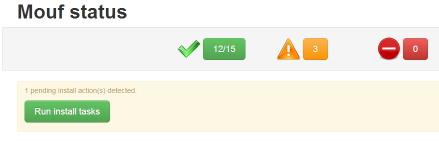
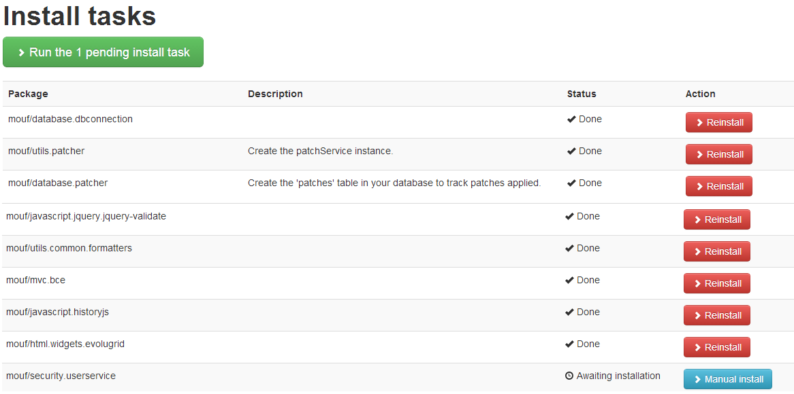

Installing <b>UserService</b>
=============================

- Add <b>UserService</b> to your project:
	- Add the following link in your composer.json:  <code>"mouf/security.userservice": "2.0.*"</code>
	
		```json	
		{
		    "require": {
		        "mouf/mouf": "~2.0",
				"mouf/database.tdbm": "~3.1",
				"mouf/security.userservice": "2.0.*"
		    },
		    "minimum-stability": "dev" 
		}
		```
		
		Please note: we are also installing [TDBM](http://mouf-php.com/packages/mouf/database.tdbm). This will be used
		later in order to store/access users in database.
		
	- Install the package:
	
		```sh	
		php composer.phar update
		```
	
	- After install, log in Mouf interface <code>http://[your_server]/[your_project]/vendor/mouf/mouf/</code>, you should have this kind of display:
	
	
	
	
	
	- You can see all pending installation tasks through <code>YourProject/vendor/mouf/mouf/installer</code> (or in the **Packages**=>**Installation tasks** menu) 
	  or by clicking "Run install tasks" button in the status page:
	
	
	
	
	
	- Click on "Run the x pending install task" green button to proceed the installation
		- Installation create a <code>userService</code> instance of the <code>UserService</code> class in your Mouf Project
		
	- UserService is not yet ready to be used. We need to configure it.

But first, we need to plug the UserService in a UserDao that will fetch users from database.

> Configuration : [Preparing the UserDao](userServiceInterfaces.md)